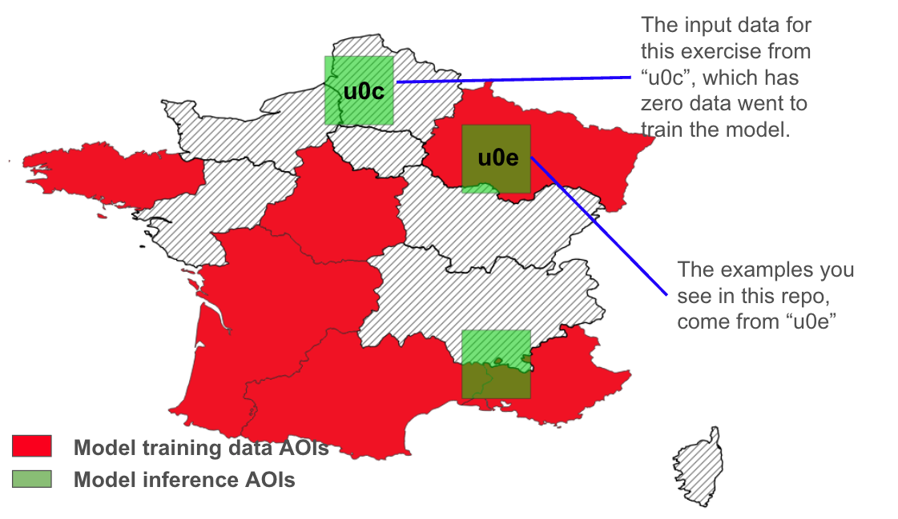
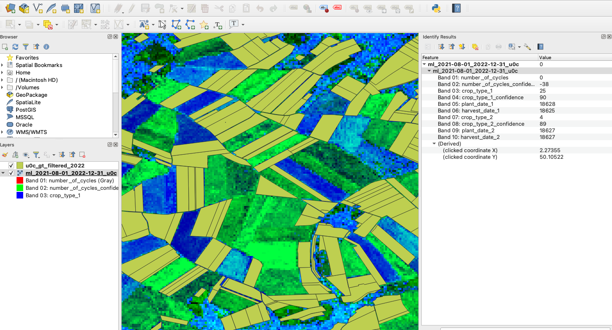

# Regrow ML Data Scientist Technical Exercise: Simplified Active Learning


## Overview

This exercise is designed to assess your ability to analyze geospatial data, diagnose model performance issues, and strategize improvements for an crop monitoring machine-learning model. You will work with [raster-based model output](https://drive.google.com/file/d/1R_4NtTIUrQHo7cGA-Xi26KvUh3RYjLa3/view?usp=drive_link), and [ground truth (GT) labeled crop data](https://drive.google.com/file/d/1uOM9DlyNp4V2dNtW_cSt8VLvTRSzlGn6/view?usp=drive_link) to identify underperforming crops and suggest improvements to the model training pipeline.

You are welcome to use any AI assistant tools that you feel comfortable with, such as ChatGPT, CoPilot, DeepSeek, Claude, etc.The recommended time to complete the tasks is **less than 5 hours**.

If you have any questions about any part of the exercise, please don’t hesitate to get in touch with nana@regrow.ag.

## Background & Data Explanation

We are training a time-series machine learning model for **32 crop types in France**. The training data quality varies from state to state. To ensure model reliability, we trained a model using training data from states **highlighted in red** on the map, where we have high confidence in the data quality. We then ran model inference on **three Areas of Interest (AOIs)** (shown in green) to evaluate model performance.



The examples provided in this exercise are from the `u0e` AOI, where we had some training data for model training. In this AOI, we conducted [a similar analysis](support_files/u0e_gt_model_example.gpkg) to what you are tasked with in this exercise. The dataset includes model predictions and ground truth comparisons, which you can use as a reference for your implementation. Feel free to use these examples as guidance throughout your technical exercise. By analyzing [model performance within `u0e` AOI](support_files/u0e_gt_crop_and_crop_confidence_fr.csv), we gained insights into where the model struggled and identified crops that were frequently misclassified.

Your goal here is to implement an active learning approach to systematically detect underperforming crops from the model predictions and strategically incorporate them back into the training pipeline. This process aims to refine the model’s accuracy by iteratively improving its ability to differentiate between crops, particularly in AOIs where it currently struggles due to a lack of representative training data.

You are provided with three input datasets from the **u0c AOI** (see map above), where we had **zero training data** in the current model:



1. **Model Prediction (GeoTIFF, 10 Bands)** (see the following QGIS view of input data): The dataset contains multiple spectral bands. Your task is to extract:
   - **Band 3**: Crop type predictions.
   - **Band 4**: Model confidence scores for Band 3.
   - Summarize these values at the **field level** and compare them against ground truth data list as 2 as follows.
2. **Ground Truth (GT) Data (2022, GPKG format)**: Contains gound truth (GT) labeled crop information for validation.
3. **Crop Mapping Dictionary**: Provides a mapping between numerical values in the **GeoTIFF Band 3** and actual crop types.
   - Example: **Pixel value 0 → Grassland Cultivated**, **Pixel value 7 → Winter Wheat**.

**Note**: The values in the mapping dictioary correspond to `normalized_label` column in the GT GPKG too.

```python
LABELS_DICT = {
    "Grassland Cultivated": ["grassland_cultivated"],
    "Grassland Nature": ["grassland_nature"],
    "Clover": ["clover"],
    "Alfalfa": ["alfalfa"],
    "Ryegrass": ["ryegrass"],
    "Winter Barley": ["barley_winter"],
    "Spring Barley": ["barley_spring", "barley_summer"],
    "Winter Wheat": ["wheat_winter"],
    "Triticale": ["triticale_winter", "triticale_spring"],
    "Winter Rye": ["rye_winter"],
    "Spring Rye": ["rye_spring"],
    "Spring Wheat": ["wheat_spring"],
    "Rice": ["rice"],
    "Millet": ["millet"],
    "Sorghum": ["sorghum", "Sorghum"],
    "Spring Oats": ["oats_spring"],
    "Winter Oats": ["oats_winter"],
    "Sunflowers": ["sunflowers", "sunflower"],
    "Flax": ["flax"],
    "Canola": ["canola_spring", "canola_winter"],
    "Grain Corn": ["corn_grain"],
    "Silage Corn": ["corn_silage"],
    "Potatoes": ["potatoes"],
    "Sugarbeets": ["sugarbeets", "beets"],
    "Soybeans": ["soybeans"],
    "Peas": ["peas", "peas_winter"],
    "Beans": ["beans"],
    "Lentils": ["lentils"],
    "Fallow": ["fallow"],
    "Turnips": ["turnips", "turnip"],
    "Trees": ["trees", "orchard", "orchards", "bananas"],
    "Vineyard": ["vineyard"],
}
```

## Goal

Your task is to:

1. Identify underperforming crops from the provided raster dataset.
2. Diagnose confusion between crop types and propose a strategy to improve model performance.
3. Implement efficient geospatial processing using **Rasterio**, **Geopandas**, and parallel computation.
4. Provide a structured output and recommendations on how to enhance the training pipeline.


## [Inputs](https://drive.google.com/drive/folders/1zjfju-JsNMJ-Z_nhkhcp2R3-FM2X6u2a?usp=drive_link)

- **GeoTIFF Raster (310MB)**: [Available on Google Drive (GDrive)](https://drive.google.com/file/d/1R_4NtTIUrQHo7cGA-Xi26KvUh3RYjLa3/view?usp=drive_link) - this represents model inference outputs.
- **GeoDataFrame (~154,000 fields)**: Available on the GDrive - contains crop labels and field geometries as [GPKG](https://drive.google.com/file/d/1uOM9DlyNp4V2dNtW_cSt8VLvTRSzlGn6/view?usp=sharing)
- **Crop mapping dictionary**: shown above.

[Two input files (GeoTIFF and GPKG)](https://drive.google.com/drive/folders/1zjfju-JsNMJ-Z_nhkhcp2R3-FM2X6u2a?usp=sharing) are provided on GDrive.


## Expected Deliverables

- **GitHub Repository** (Hard Requirement)
- **Code Implementation**: Well-structured, containerized, efficient, and documented.
- **Outputs**:
  - **CSV file** summarizing underperforming crops.
  - **PNG visualization(s)** illustrating model confusion areas.
- **Commit History & Branches** demonstrating iterative development.
- **README** Providing clear instructions how to run your code and insights from this exercise.

## Technical Requirements

- **Python Libraries**: Rasterio, Geopandas, Scikit-learn, Pandas, NumPy, Matplotlib / Seaborn.
- **Parallel Processing**: Optimize geospatial computations to ensure efficiency.
- **Model Evaluation**:
  - Compute confusion matrix, F1-score. In [the example](support_files/u0e_gt_crop_and_crop_confidence_fr.csv) we have `agreement score` it's defined as percentage of fields where model and GT agree on the crop type.
  - Identify underperforming crops based on model confidence and agreement/F1 score.
     - **Note**: underperforming crops can be those with low agreement/f1 scores and low model confidence.
  - Develop strategies to enhance training performance.
    - **Note**: Strategies can include underperform crop types, number of fields to add, etc.

## Bonus Points

A complete submission should include a few basic elements of a data engineering workflow, including:
- **Worlfow Automation**: Provide a script to automate the data processing pipeline.
- **Performance Optimization**: End-to-end processing time under 5 minutes.
- **Unit Tests**: Write tests to validate data processing steps.

We are not expecting production level code, but would like to get a sense for how you think about the problem.


## Submission Guidelines

1. **Start a new repository** on your GitHub account.
2. **Develop your solution** and maintaining a clean commit history.
3. **Push your solution** to your repository.
4. **Submit a link** of your GitHub repository to nana@regrow.ag if it's public, or add GitHub handdles @Geoyi and @geospatial-jeff as collaborators if it's a private repository.

## Evaluation Criteria

- **Correctness**: Are the outputs accurate and meaningful?
- **Efficiency**: Is the code optimized for performance?
- **Code Quality**: Is the code well-structured, modular, containerized and documented?
- **Analysis & Strategy**: Are the proposed improvements logical and feasible?

---

We look forward to your submission! 🚀